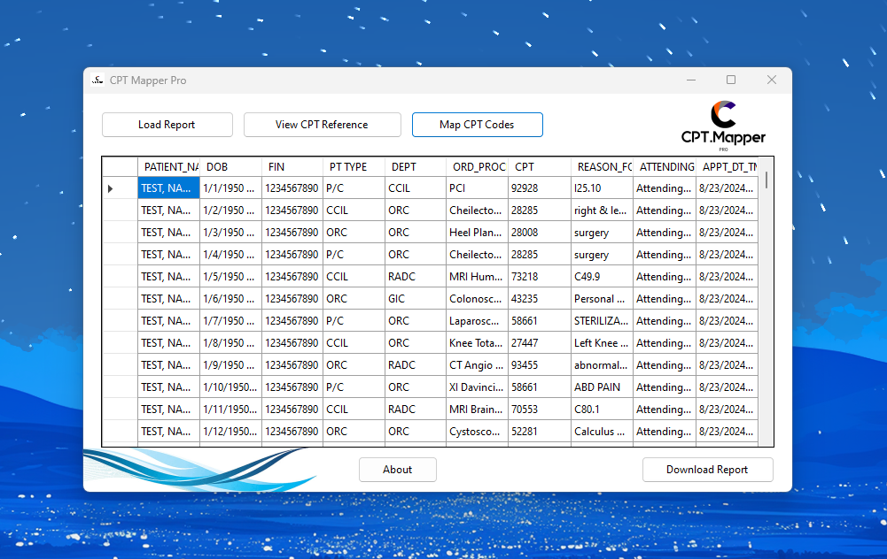

# BillingCodeMapperPro

## Overview

**BillingCodeMapperPro** is a Windows Forms application I developed to allow allows users to **map CPT billing codes** to pre-existing Excel-based patient reports using a static reference file. This helps streamline documentation and charge capture workflows for common elective order procedures at inpatient & outpatient healthcare facilities.

## Features

- Load patient reports from `.xlsx` Excel files, or exported CSV files from your sql query.
- View the CPT reference directly from the interface.
- Automatically map missing CPT codes based on order procedure names.
- Export the newly CPT-mapped report as a formatted Excel file.

## How It Works

1. **Load Report** – Select a report `.xlsx` file exported from EPIC or other scheduling systems.
2. **View CPT Reference** – Open the reference list for CPT mapping.
3. **Map CPT Codes** – Automatically fills in missing CPT codes.
4. **Download Report** – Saves a new Excel file with mapped CPTs.

## Requirements

- Windows 10/11
- [.NET 6 Desktop Runtime](https://dotnet.microsoft.com/en-us/download/dotnet/6.0) (required if not using the self-contained build)

> _This reporting model uses a user created static reference file of CPT to Order Procedure pairs. A dynamic billing code database using an API will be more feasable for expansion.  

---

